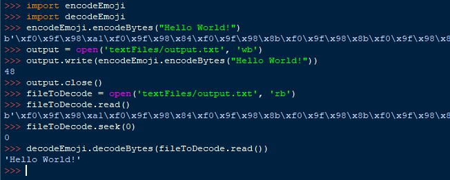

# emoji-encode
 An encoder for (almost all) ASCII text to emojis.
 

By installing and importing the scripts into your python code, you can encode ASCII text into emoji symbols.

The encode() function will turn text into strings of unicode emojis, while the decode() funation will do the opposite. 
The encodeBytes() function will encode text into the emojis, then encode into utf-8 so it can be written into files.
decodeBytes() will decode utf-8 encoded emojis into ASCII text.

Credits
=======

Thanks to JKirchartz for the transcript of The Pipe for testing purposes. (https://gist.github.com/JKirchartz/0fe59db390528740cd9eb5a1d0e35b7f)

